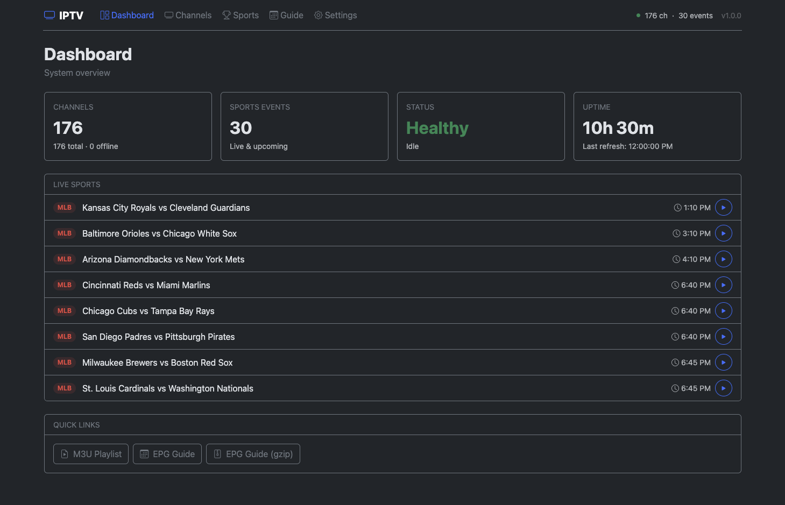
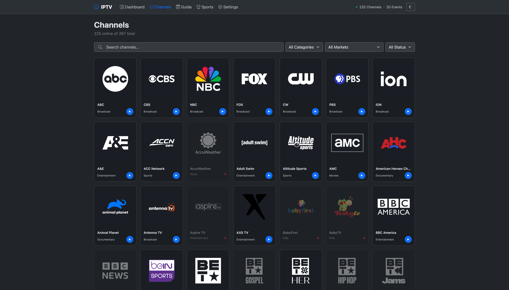
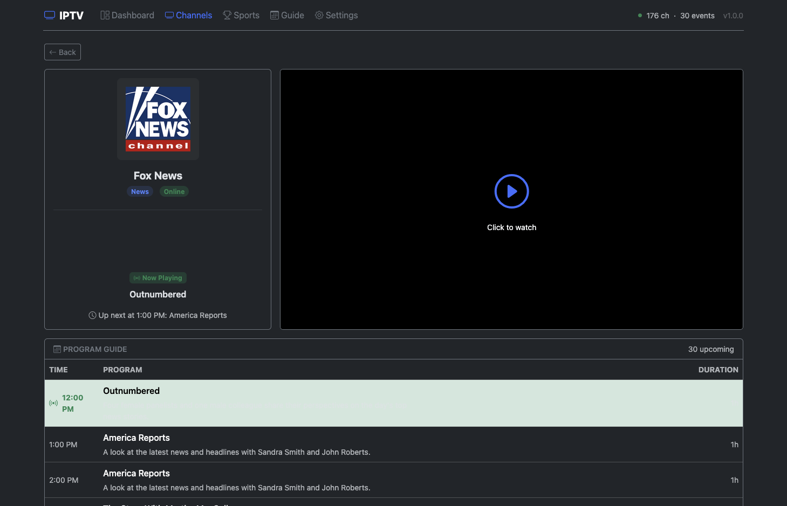
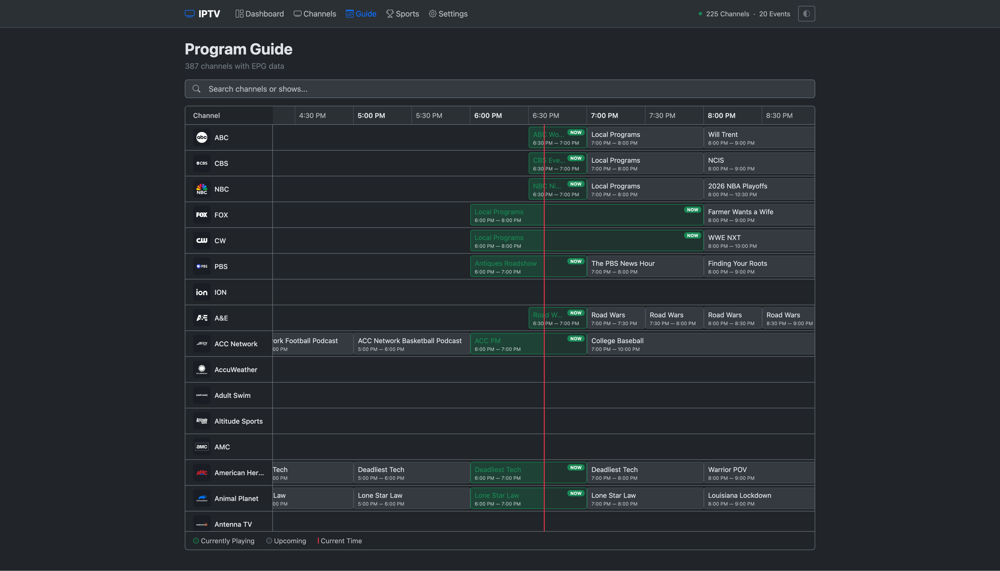
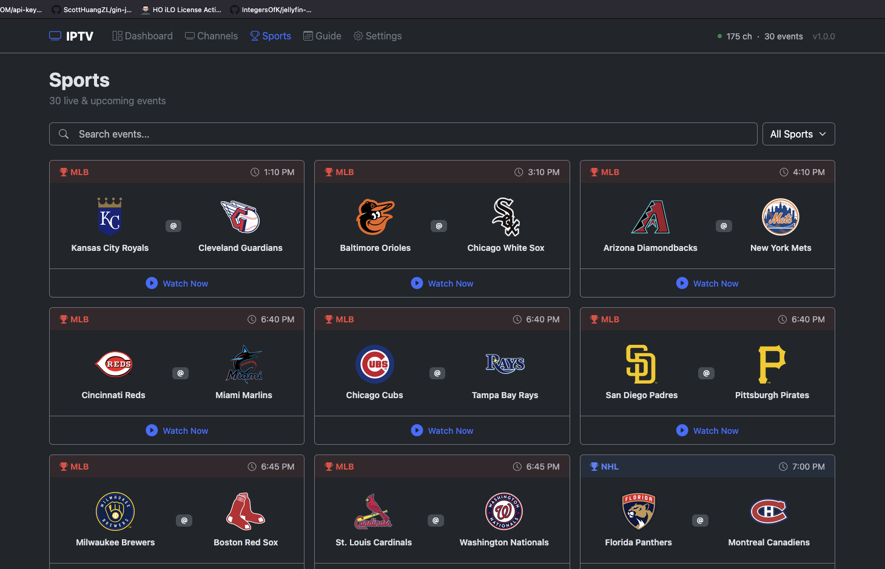
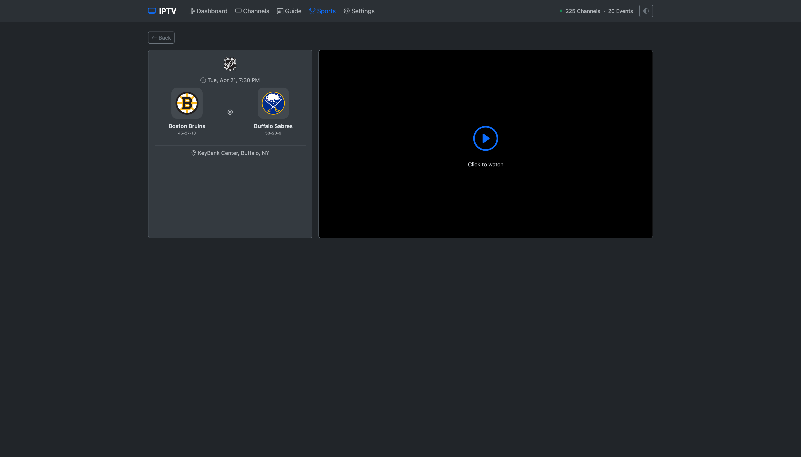
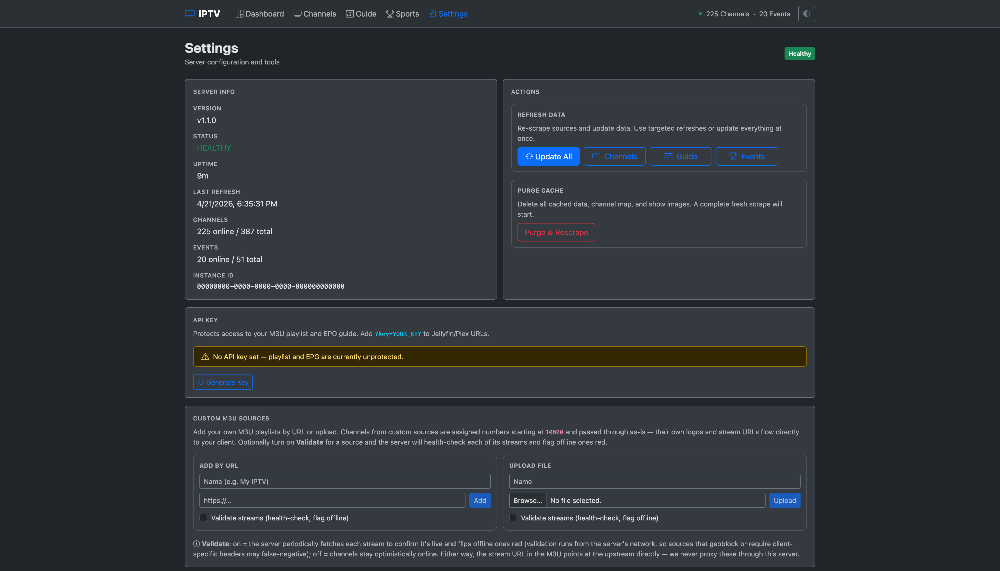

<div align="center">

# IPTV

**Self-hosted IPTV server for live TV and sports**

[](https://hub.docker.com/r/rebelstream/iptv)
[](https://hub.docker.com/r/rebelstream/iptv)
[](https://github.com/rebelstream/iptv/releases/latest)
[](LICENSE)

Aggregates live TV channels and sports events into a single M3U playlist with full EPG guide data.<br>
Streams are fully proxied so upstream sources are never exposed to clients.<br>
Designed for **Jellyfin**, **Plex**, **Emby**, and other IPTV apps.

</div>

---

## Screenshots

<details>
<summary><strong>Dashboard</strong> — system overview with live sports</summary>
<br>


</details>

<details>
<summary><strong>Channels</strong> — searchable channel list with categories</summary>
<br>


</details>

<details>
<summary><strong>Channel Detail</strong> — video player with program guide</summary>
<br>


</details>

<details>
<summary><strong>Guide</strong> — EPG program schedule</summary>
<br>


</details>

<details>
<summary><strong>Sports</strong> — live events sorted by start time</summary>
<br>


</details>

<details>
<summary><strong>Sport Event</strong> — live scores from ESPN</summary>
<br>


</details>

<details>
<summary><strong>Settings</strong> — API key management and server info</summary>
<br>


</details>

## Features

- **380+ TV channels** with logos and persistent channel numbers that never reshuffle
- **Live sports events** -- see [Supported Live Sports](#supported-live-sports) below
- **Custom M3U sources** -- add your own M3U URLs or upload files to merge into the playlist; edit the URL or replace the uploaded file later without losing channel numbers
- **Channel categories** -- Sports, News, Local, Kids, Movies, Entertainment, Lifestyle, Documentary, and more
- **Local station detection** -- identifies call signs (KABC, WCBS, etc.)
- **Multi-source stream fallback** -- events and channels automatically try alternate providers if the primary feed fails, both at refresh time and mid-watch
- **Broadcast-network affiliate fallback** -- ABC / CBS / NBC / FOX automatically fall through to the flagship East Coast affiliate when the network's own feed isn't playable
- **Stream health monitoring** -- automatically detects offline channels and recovers them
- **ESPN-powered live sports** -- real-time scores, period-by-period linescore, venue, weather, and game situation data
- **Rich EPG data** -- 24-hour XMLTV guide with show descriptions, episode info, season/episode numbers, TV ratings, and show/movie poster artwork
- **Horizontal timeline guide** -- scrollable program grid with sticky channel column and current-time indicator
- **Theme switcher** -- light, dark, or auto (system preference detection)
- **Built-in video player** -- program progress bar, now-playing, up-next preview, and event scoreboards
- **Docker-network friendly URLs** -- one-click toggle in Settings switches copied playlist / EPG URLs between the dashboard's origin and the container's internal hostname, so Jellyfin / Plex containers on the same Docker network work without hand-editing
- **Targeted refresh controls** -- refresh just channels, just events, just the guide, or everything
- **Automatic failover** -- if a live stream hiccups mid-watch, the proxy switches to the next provider without ending the session
- **Cache survives restarts** -- the playlist, guide, and in-flight stream tokens are restored on boot, so clients keep playing through a container restart
- Continuous MPEG-TS stream proxy (works like a real TV tuner for Jellyfin/ffmpeg)
- Sport events sorted by start time with team logos and pregame/postgame EPG entries
- API key protection for playlist and EPG endpoints
- Automatic hourly refresh with offline channel recovery every 5 minutes
- Graceful shutdown with SIGTERM handling
- Multi-architecture Docker support (amd64, arm64)

## Supported Live Sports

The following leagues currently have working live event feeds:

| League  | Sport             |
|---------|-------------------|
| **NHL** | Ice Hockey        |
| **NFL** | American Football |
| **NBA** | Basketball        |
| **MLB** | Baseball          |
| **MLS** | Soccer            |

ESPN is the source of truth for all schedules, team names, and scores — scrapers only contribute stream URLs that are cross-referenced against ESPN's canonical game data. Other leagues will be added as upstream feeds become available. To request a new league, [open a feature request](https://github.com/rebelstream/iptv/issues/new/choose).

## Quick Start

### Docker Compose (recommended)

Create a `docker-compose.yml`:

```yaml
services:
    iptv:
        image: rebelstream/iptv:latest
        container_name: iptv
        hostname: iptv          # lets clients on this compose network reach us by name
        ports:
            - "8080:8080"
        environment:
            TZ: "America/New_York"
        volumes:
            - ./data:/app/data
        restart: unless-stopped
```

```bash
docker compose up -d
```

### Docker Run

```bash
docker run -d \
  --name iptv \
  -p 8080:8080 \
  -e TZ=America/New_York \
  -v ./data:/app/data \
  --restart unless-stopped \
  rebelstream/iptv:latest
```

## Setting Up an API Key

Playlist and EPG endpoints can optionally be protected with an API key.

1. Open the web dashboard at `http://<server-ip>:8080`
2. Go to **Settings**
3. Click **Generate Key**
4. Use the key in your client URLs: `http://<server-ip>:8080/playlist?key=YOUR_KEY`

Without a key, playlist and EPG are accessible to anyone on your network.

## Usage with IPTV Clients

### Jellyfin

1. Go to **Dashboard > Live TV > Tuner Devices > Add**
2. Select **M3U Tuner**
3. Enter the M3U URL: `http://<server-ip>:8080/playlist?key=YOUR_KEY`
4. The EPG guide URL is auto-discovered from the playlist header
5. Save and refresh guide data

**Recommended tuner settings:**
- Allow stream sharing: **enabled**
- Auto-loop live streams: **enabled**
- Read input at native frame rate: **enabled**

### Plex

1. Install the **IPTV** plugin or use **xTeVe** as middleware
2. M3U URL: `http://<server-ip>:8080/playlist?key=YOUR_KEY`
3. EPG URL: `http://<server-ip>:8080/epg?key=YOUR_KEY`

### General IPTV Clients

| File             | URL                                             |
|------------------|-------------------------------------------------|
| M3U Playlist     | `http://<server-ip>:8080/playlist?key=YOUR_KEY` |
| EPG Guide (XML)  | `http://<server-ip>:8080/epg?key=YOUR_KEY`      |
| EPG Guide (Gzip) | `http://<server-ip>:8080/epg.gz?key=YOUR_KEY`   |

> **Note:** The `?key=` parameter is only required if an API key has been generated in the web dashboard under **Settings**.

## Web Dashboard

Access the dashboard at `http://<server-ip>:8080`.

### Pages

- **Dashboard** -- channel/event counts, online/offline stats, live sports with start times and scores, playlist copy buttons
- **Channels** -- searchable and filterable channel list with category badges and online/offline status. Click a channel for its detail page with video player and program guide.
- **Guide** -- horizontal timeline program grid with sticky channel column, current-time indicator, and scrollable schedule
- **Sports** -- live and upcoming events grouped by date with team logos, live scores, and "Stream Not Available Yet" indicators for upcoming games. Click an event for its detail page with live scoreboard and video player.
- **Settings** -- API key management, theme switcher, custom M3U source management, Docker container-hostname toggle for endpoint URLs, server info, version update check, targeted manual refresh (channels / guide / events / all)

### Channel Detail

Click any channel to see:
- Channel logo, categories, and status
- Embedded video player (click to watch)
- Now playing info with up-next preview
- Full program guide

### Sport Event Detail

Click any sport event to see:
- Team logos with live scores from ESPN (updates every 30 seconds)
- Period-by-period linescore
- Game status, venue, weather, and in-game situation
- Embedded video player with automatic fallback to alternate stream sources

## Configuration

| Variable        | Default      | Description                                                                                                  |
|-----------------|--------------|--------------------------------------------------------------------------------------------------------------|
| `PORT`          | `8080`       | Server port                                                                                                  |
| `HOST`          | `0.0.0.0`    | Bind address                                                                                                 |
| `CRON_SCHEDULE` | `30 * * * *` | Data refresh schedule (cron)                                                                                 |
| `SPORTS_EVENTS` | `true`       | Set to `false` to disable sports events                                                                      |
| `SPORTS_MODE`   | `false`      | Sports-only mode — disables TV channels, serves only live events                                             |
| `LEAGUES`       | `""`         | Comma-separated league codes (e.g. `NHL,NBA,MLB`) — empty means all                                          |
| `TZ`            | `Etc/UTC`    | Timezone                                                                                                     |

### Cron Schedule Examples

| Schedule       | Meaning                                |
|----------------|----------------------------------------|
| `30 * * * *`   | Every hour at 30 minute mark (default) |
| `*/30 * * * *` | Every 30 minutes                       |
| `0 */3 * * *`  | Every 3 hours                          |
| `0 0 * * *`    | Once daily at midnight                 |

## How It Works

### Channels

On startup and once an hour, the server scrapes channel data, normalizes names, detects categories, and checks stream health. Offline channels are rechecked every 5 minutes.

Channel numbers are **stable** — every channel has a fixed number baked into the build, so your Jellyfin/Plex bookmarks survive cache purges and upgrades. Numbers are allocated in ranges:

| Range  | Use                                           |
|--------|-----------------------------------------------|
| 1–4999 | Curated broadcast networks and cable channels |
| 5000+  | Live sports events (assigned per refresh)     |
| 10000+ | Custom M3U sources (one range per source)     |

Local broadcast stations are identified by their FCC call sign. For example, "ABC (KABC) Los Angeles" becomes **KABC (Los Angeles, CA)** with affiliate **ABC**, and is rendered as a dynamic SVG showing the ABC network logo with the call sign and city overlay.

Channels are grouped by category in the M3U playlist using `group-title`. Multiple categories are supported (e.g., a local station gets both "Local" and "News").

### Custom M3U Sources

Add your own M3U playlists (URL or file upload) from the Settings page. Custom channels are merged into your playlist and EPG, numbered in the 10000+ range, and persist across restarts.

Each source can be edited after adding — rename it, change the URL, or upload a replacement M3U file — without losing its channel-number slot. Turn on the optional **Validate** toggle and the server health-checks each stream and marks offline ones red. While a source is being fetched or validated in the background, the entry shows a "loading" pill and updates automatically when the check completes.

### Sports Events

Sport events are scraped, then cross-referenced with ESPN's scoreboard API for accurate start times and canonical team names. Events are sorted by start time across all leagues.

Each event gets EPG entries with pregame, game, and postgame blocks:

| Sport | Pregame | Game      | Postgame |
|-------|---------|-----------|----------|
| NFL   | 30 min  | 3.5-4 hrs | 30 min   |
| NHL   | 30 min  | 3 hrs     | 30 min   |
| NBA   | 30 min  | 2.5 hrs   | 30 min   |
| MLB   | 30 min  | 3.5 hrs   | 30 min   |

Events are removed from the lineup 30 minutes after the postgame block ends.

## Persistent Data

All persistent data is stored in the `/app/data` volume:

| File                   | Purpose                                                         |
|------------------------|-----------------------------------------------------------------|
| `cache.json`           | Channels, events, and EPG data (encrypted)                      |
| `custom-sources.json`  | User-added custom M3U source definitions                        |
| `finished-events.json` | Recently finished sports events (keeps finals visible for ~24h) |
| `instance.json`        | Instance ID and API key                                         |
| `metrics.json`         | Runtime metrics (request counts, stream sessions)               |

Channel numbers and the curated channel directory are baked into the image — not in persistent data — so cache purges never reshuffle numbers.

## Reverse Proxy

The server auto-detects the correct base URL from `X-Forwarded-Proto` and `X-Forwarded-Host` headers.

### Nginx

```nginx
location / {
    proxy_pass http://127.0.0.1:8080;
    proxy_set_header Host $host;
    proxy_set_header X-Forwarded-For $proxy_add_x_forwarded_for;
    proxy_set_header X-Forwarded-Proto $scheme;
    proxy_set_header X-Forwarded-Host $host;
}
```

### Traefik

```yaml
labels:
    - "traefik.enable=true"
    - "traefik.http.routers.iptv.rule=Host(`iptv.example.com`)"
    - "traefik.http.services.iptv.loadbalancer.server.port=8080"
```

## Reporting Issues

Found a bug or want a feature? [Open an issue](https://github.com/rebelstream/iptv/issues/new/choose) using one of the templates:

- **Bug Report** -- something isn't working
- **Feature Request** -- suggest an improvement
- **Channel Request** -- missing or broken channel

## License

Proprietary -- free for personal, non-commercial use. See [LICENSE](LICENSE) for details.
